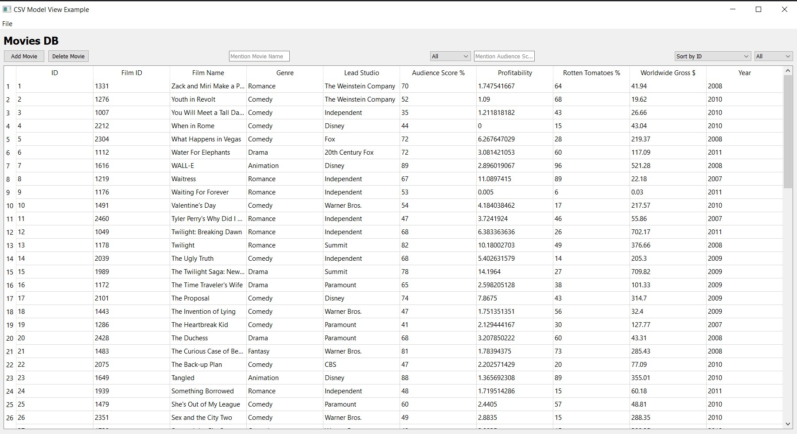

# movies_db

This is a test Project for Movies DB

This movie lists movies from a CSV file to a movies DB.

## Tool

## USAGE

## How to Run

First fix the data, create db and append values, and launch the UI

1) install postgres
2) create a database with pgadmin4
3) you can use the postgres tempalte to create a table - https://github.com/blossomsg/postgres_db_template  note: cannot create a database only table
4) [movies_csv_data.py](movies_csv_data.py) 
5) [movies_db.py]() 
6) [launch_movies_db.py](launch_movies_db.py)

## License

[GNU GENERAL PUBLIC LICENSE](LICENSE)