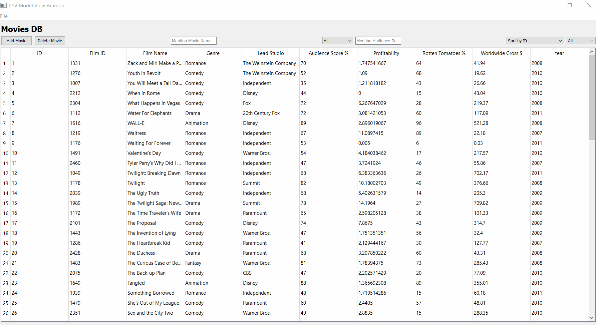

# movies_db
This is a test Project for Movies DB

This movie lists movies from a CSV file to a movies DB.

## Tool

## USAGE

## How to Run
Kindly run the script from here - [launch_movies_db.py](launch_movies_db.py)

## License
[GNU GENERAL PUBLIC LICENSE](LICENSE)